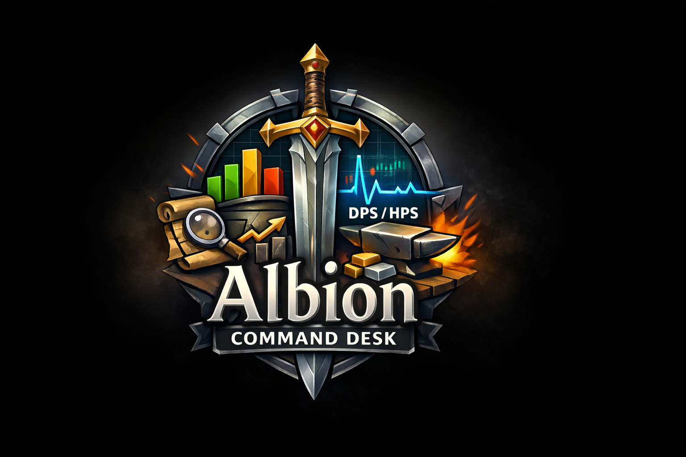
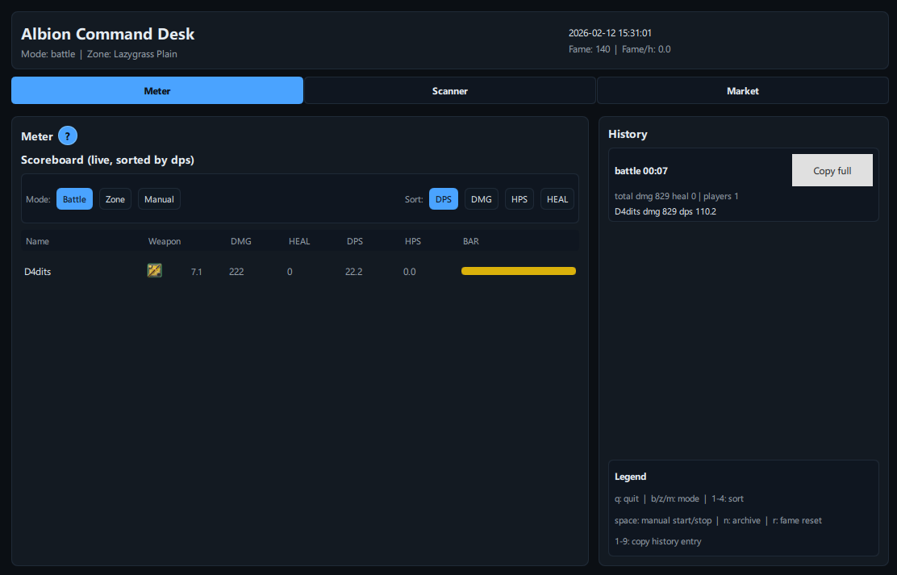

<p align="center">
  
</p>

# Albion Command Desk

Passive Albion Online companion app with a Qt desktop UI:
- DPS/HPS meter (live or PCAP replay)
- Party-only combat aggregation (self + party)
- Optional scanner helper tab
- Market crafting workspace (inputs/outputs/results)

No game client hooks, no overlays, no memory editing.

<p align="center">
  
  
  
</p>

## Support the Project
If Albion Command Desk saves you time or silver, consider supporting future updates and maintenance.

<p align="center">
  <a href="https://www.paypal.com/donate/?business=albiosuperacc%40linuxmail.org&currency_code=USD&amount=20.00"></a>
  <a href="https://buycoffee.to/ao-dps/"></a>
</p>

Donors can be featured on a public supporters list. If you want to be listed, open a GitHub issue and share the display name you want to use.

## Screenshots
<p align="center">
  
</p>

<p align="center">
  
</p>

<p align="center">
  
</p>

## Visual Regression Baseline (PH2)
- Baseline set lives in `assets/ux-baseline/`.
- Before release, compare current UI against:
  - `assets/ux-baseline/ph2-meter.png`
  - `assets/ux-baseline/ph2-scanner.png`
  - `assets/ux-baseline/ph2-market.png`
- If changes are intentional, update baseline files and note it in `CHANGELOG.md`.

## Before Install (Recommended)
Best setup before installing ACD:
- Python `3.11` or `3.12` (64-bit) with `pip` available in terminal.
- `git` installed (if you install from source checkout).
- Optional for live capture only:
  - Windows: Npcap Runtime (`https://npcap.com/#download`).
  - Linux/macOS: system packet-capture libs (`libpcap`).
- Permissions to create a local virtual environment (`venv` folder in repo).

## Install (One-Click Bootstrap)

### Windows (no Git required)
1. Open Releases: `https://github.com/D4dits/Albion-Command-Desk/releases/latest`
2. Download `AlbionCommandDesk-Setup-vX.Y.Z-x86_64.exe`.
3. Run it (installer downloads source, installs Python automatically via `winget` when available, creates persistent runtime under `%LOCALAPPDATA%\AlbionCommandDesk`, then prints launch command).
4. If installation fails, the window stays open with the exact error.

### Windows (source checkout)
```powershell
git clone https://github.com/D4dits/Albion-Command-Desk.git
cd Albion-Command-Desk
powershell -ExecutionPolicy Bypass -File .\tools\install\windows\install.ps1
```

### Linux
```bash
git clone https://github.com/D4dits/Albion-Command-Desk.git
cd Albion-Command-Desk
bash ./tools/install/linux/install.sh
```

### macOS
```bash
git clone https://github.com/D4dits/Albion-Command-Desk.git
cd Albion-Command-Desk
bash ./tools/install/macos/install.sh
```

### Optional: enable live capture profile
Capture profile is optional and not required for base app usage.

Windows:
```powershell
powershell -ExecutionPolicy Bypass -File .\tools\install\windows\install.ps1 -Profile capture
```

Linux:
```bash
bash ./tools/install/linux/install.sh --profile capture
```

macOS:
```bash
bash ./tools/install/macos/install.sh --profile capture
```

If capture prerequisites are missing, installer falls back to `core` profile by default.  
To force hard-fail instead of fallback, use strict mode:
- Windows: `-StrictCapture`
- Linux/macOS: `--strict-capture`

### Optional: generate item/map databases
For full item names, map labels, and market coverage:

Windows:
```powershell
powershell -ExecutionPolicy Bypass -File .\tools\extract_items\run_extract_items.ps1 -GameRoot "C:\Program Files\Albion Online"
```

Linux/macOS:
```bash
./tools/extract_items/run_extract_items.sh --game-root "/path/to/Albion Online"
```

### What bootstrap installer does
- checks Python and required tools
- creates/reuses local `venv`
- installs ACD profile (`core` default, `capture` optional)
- runs smoke checks (CLI import + Qt startup probe)
- starts app in mode matching profile (`core` or `live`)

## Run
If you used bootstrap installer with `-SkipRun`, start from the repo venv:

Windows:
```powershell
.\venv\Scripts\albion-command-desk core
# live capture (capture profile required):
# .\venv\Scripts\albion-command-desk live
```

Linux/macOS:
```bash
./venv/bin/albion-command-desk core
# live capture (capture profile required):
# ./venv/bin/albion-command-desk live
```

PCAP replay:
```powershell
albion-command-desk replay .\path\to\capture.pcap
```

Interface selection:
```powershell
albion-command-desk live --list-interfaces
albion-command-desk live --interface "Ethernet"
```

## Key Runtime Flags
- `--sort dmg|dps|heal|hps`
- `--top <N>`
- `--mode battle|zone|manual`
- `--history <N>`
- `--battle-timeout <seconds>`
- `--self-name "<name>"`
- `--self-id <entity_id>`
- `--debug`

## Item/Map Databases (optional but recommended)
For weapon-color mapping and map names (`Lazygrass Plain` etc.) generate local files:
- `data/indexedItems.json`
- `data/items.json`
- `data/map_index.json`

Windows:
```powershell
.\tools\extract_items\run_extract_items.ps1 -GameRoot "C:\Program Files\Albion Online"
```

Linux/macOS:
```bash
./tools/extract_items/run_extract_items.sh --game-root "/path/to/Albion Online"
```

If missing, app falls back gracefully and can prompt for game path.

## Market Dataset Pipeline
Build market recipes from local game files:

Windows:
```powershell
.\tools\market\run_build_recipes_from_items.ps1 -Strict
```

Linux/macOS:
```bash
./tools/market/run_build_recipes_from_items.sh
```

Output:
- `albion_dps/market/data/recipes.json`
- `artifacts/market/recipes_from_items_report.json`
- `artifacts/market/recipes_build_report.json`

## Release Metadata (Update Contract)
Update notifications and installer discovery use a release manifest contract:
- Spec: `docs/release/RELEASE_MANIFEST_SPEC.md`
- Example payload: `tools/release/manifest/manifest.example.json`
- Builder: `tools/release/manifest/build_manifest.py`
- Publisher helper (Windows): `tools/release/manifest/publish_manifest.ps1`
- Last-known-good pointer updater: `tools/release/manifest/set_last_known_good.ps1`
- One-command rollback: `tools/release/manifest/rollback_manifest.ps1`
- CI publisher: `.github/workflows/release-manifest.yml`
- Release asset smoke workflow: `.github/workflows/release-asset-smoke.yml`
- Release asset verifier: `tools/qa/verify_release_artifact_matrix.py`
- Default runtime endpoint: `https://github.com/D4dits/Albion-Command-Desk/releases/latest/download/manifest.json`
- Clean-machine bootstrap smoke CI: `.github/workflows/bootstrap-smoke.yml`
- Runtime override endpoint: set `ALBION_COMMAND_DESK_MANIFEST_URL`
- UI controls: `Auto update` toggle + `Check now` action in the header

## Troubleshooting and Docs
- `docs/DELIVERY_BACKLOG.md` (active ticket queue and implementation order)
- `CHANGELOG.md` (all delivered changes)
- `docs/TROUBLESHOOTING.md`
- `docs/ARCHITECTURE.md`
- `docs/MARKET_ARCHITECTURE.md`
- `docs/MARKET_TROUBLESHOOTING.md`
- `docs/MARKET_DATASET_UPDATE.md`
- `docs/release/RELEASE_CHECKLIST.md`
- `docs/release/RELEASE_RUNBOOK.md`
- `tools/release/windows/README.md`

## Tests
```powershell
python -m pytest -q
```

If Windows temp permissions break pytest, set:
```powershell
$env:TEMP="$PWD\\artifacts\\tmp"
$env:TMP=$env:TEMP
python -m pytest -q
```
