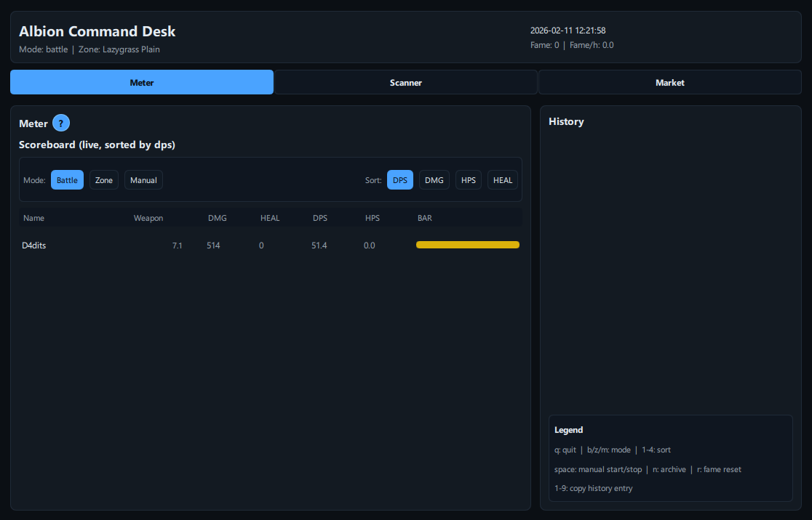

# Albion Command Desk

Passive Albion Online companion app with a Qt desktop UI:
- DPS/HPS meter (live or PCAP replay)
- Party-only combat aggregation (self + party)
- Optional scanner helper tab
- Market crafting workspace (inputs/outputs/results)

No game client hooks, no overlays, no memory editing.

<p align="center">
  
  
  
</p>

## Support the Project
If this app saves you time or silver, support ongoing development:

<p align="center">
  <a href="https://buycoffee.to/ao-dps/"></a>
  <a href="https://www.paypal.com/donate/?business=zlotyjacek%40gmail.com&currency_code=USD&amount=20.00"></a>
</p>

Want to appear on a public supporters list after donating? Open a GitHub issue and share the display name you want to use.

## Screenshots
<p align="center">
  
</p>

<p align="center">
  
</p>

<p align="center">
  
</p>

## Install
Windows PowerShell:
```powershell
python -m venv venv
.\venv\Scripts\Activate.ps1
python -m pip install -U pip
python -m pip install -e .
```

Linux/macOS:
```bash
python -m venv venv
source venv/bin/activate
python -m pip install -U pip
python -m pip install -e .
```

Live capture needs packet dependencies:
```powershell
python -m pip install -e ".[capture]"
```

Testing tools:
```powershell
python -m pip install -e ".[test]"
```

## Run
Live capture:
```powershell
albion-command-desk live
```

PCAP replay:
```powershell
albion-command-desk replay .\path\to\capture.pcap
```

Interface selection:
```powershell
albion-command-desk live --list-interfaces
albion-command-desk live --interface "Ethernet"
```

Compatibility aliases still work:
- `albion-dps live`
- `albion-dps replay <pcap>`
- `albion-dps qt live`

## Key Runtime Flags
- `--sort dmg|dps|heal|hps`
- `--top <N>`
- `--mode battle|zone|manual`
- `--history <N>`
- `--battle-timeout <seconds>`
- `--self-name "<name>"`
- `--self-id <entity_id>`
- `--debug`

## Item/Map Databases (optional but recommended)
For weapon-color mapping and map names (`Lazygrass Plain` etc.) generate local files:
- `data/indexedItems.json`
- `data/items.json`
- `data/map_index.json`

Windows:
```powershell
.\tools\extract_items\run_extract_items.ps1 -GameRoot "C:\Program Files\Albion Online"
```

Linux/macOS:
```bash
./tools/extract_items/run_extract_items.sh --game-root "/path/to/Albion Online"
```

If missing, app falls back gracefully and can prompt for game path.

## Market Dataset Pipeline
Build market recipes from local game files:

Windows:
```powershell
.\tools\market\run_build_recipes_from_items.ps1 -Strict
```

Linux/macOS:
```bash
./tools/market/run_build_recipes_from_items.sh
```

Output:
- `albion_dps/market/data/recipes.json`
- `artifacts/market/recipes_from_items_report.json`
- `artifacts/market/recipes_build_report.json`

## Troubleshooting and Docs
- `docs/TROUBLESHOOTING.md`
- `docs/ARCHITECTURE.md`
- `docs/MARKET_ARCHITECTURE.md`
- `docs/MARKET_TROUBLESHOOTING.md`
- `docs/MARKET_DATASET_UPDATE.md`

## Tests
```powershell
python -m pytest -q
```

If Windows temp permissions break pytest, set:
```powershell
$env:TEMP="$PWD\\artifacts\\tmp"
$env:TMP=$env:TEMP
python -m pytest -q
```
