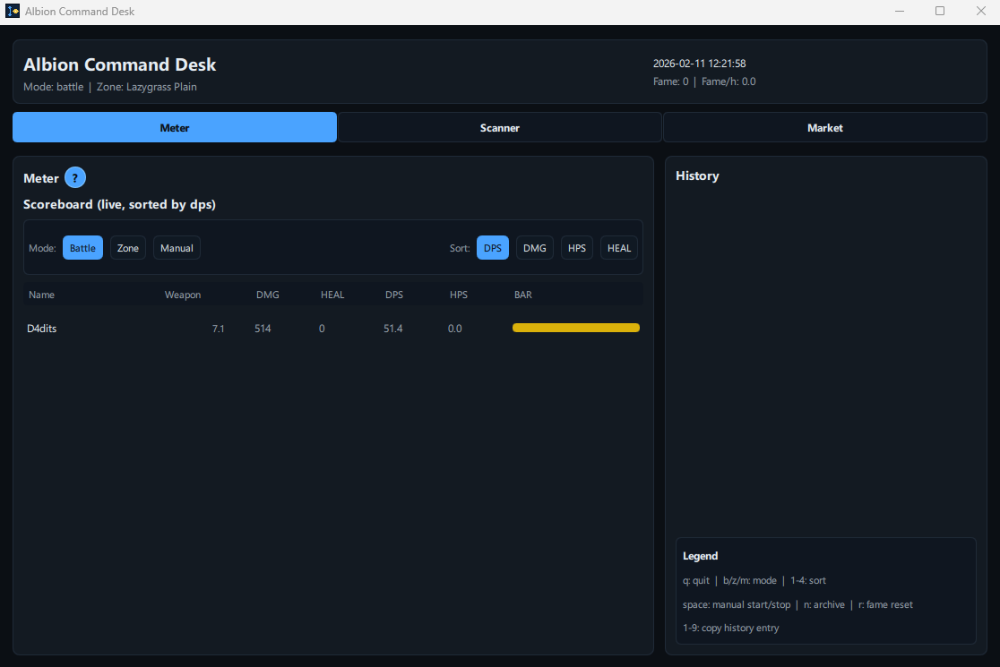
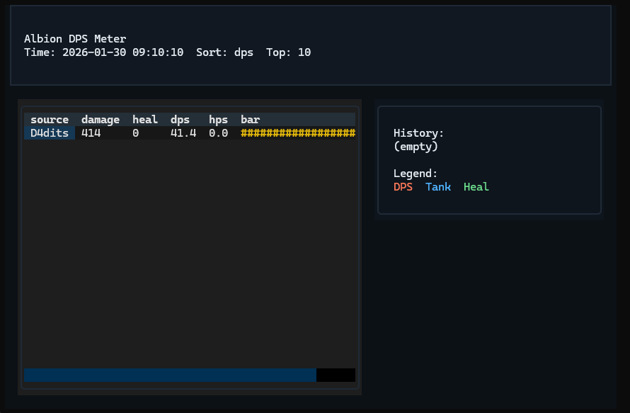

# Albion Command Desk

Passive DPS/HPS meter for Albion Online with a Qt desktop UI and optional terminal tools.
It reads UDP traffic only (PCAP replay or live capture); no client hooks, overlays, or modifications.

Core safety rule: the meter aggregates only the local player and party members (never unrelated nearby players).

<p align="center">
  
  
  
</p>

---

## Screenshots
<p align="center">
  
</p>

<p align="center">
  
</p>

## Support the project

If this project helps you and you'd like to support further development,
you can buy me a coffee:

[](https://buycoffee.to/ao-dps/)

Every contribution helps - thank you!

## Quickstart (Windows / PowerShell)
1) Create and activate a virtualenv:
```
python -m venv venv
.\venv\Scripts\Activate.ps1
```
2) Install this repo (editable) with all optional extras:
```
python -m pip install -U pip
python -m pip install -e ".[all]"
```
3) Replay a PCAP (your capture or a shared fixture):
```
albion-command-desk replay .\path\to\file.pcap
```
4) Live capture:
```
albion-command-desk live
```

## Quickstart (Linux)
1) Create and activate a virtualenv:
```
python -m venv venv
source venv/bin/activate
```
2) Install this repo (editable) with all optional extras:
```
python -m pip install -U pip
python -m pip install -e ".[all]"
```
3) Replay a PCAP:
```
albion-command-desk replay /path/to/file.pcap
```
4) Live capture (pick the right interface):
```
albion-command-desk live --list-interfaces
albion-command-desk live --interface "wlp3s0"
```
5) If live capture fails with "Operation not permitted", grant capture permissions:
```
sudo setcap cap_net_raw,cap_net_admin=eip "$(which python)"
```
Alternative (run with sudo using the venv python):
```
sudo "$(which python)" -m albion_dps live
```

## Requirements
- Python 3.10+
- Replay mode: no extra dependencies
- Live capture:
  - Windows: Npcap installed (recommended: "WinPcap API-compatible mode") + `pcapy-ng`
  - Linux: libpcap + `pcapy-ng`

## Install
Editable install (recommended for development):
```
python -m pip install -e .
```
Optional extras:
```
python -m pip install -e ".[capture]"
python -m pip install -e ".[test]"
python -m pip install -e ".[all]"
```

If `albion-command-desk` is not recognized, you likely forgot to activate the venv or install the project.
See `docs/TROUBLESHOOTING.md`.
Legacy alias `albion-dps` is still available for compatibility.

## Run
After installing (provides the `albion-command-desk` command):
```
albion-command-desk replay artifacts/pcaps/albion_combat_12_party.pcap
albion-command-desk live
```

Without installing (runs directly from the repo checkout):
```
python -m albion_dps replay artifacts/pcaps/albion_combat_12_party.pcap
python -m albion_dps live
```

Common flags:
```
--sort dmg|dps|heal|hps
--top N
--snapshot out.json
--debug
--self-name "YourName"
--self-id 123456
--mode battle|zone|manual
--history N
--battle-timeout 20
```
Environment defaults (optional):
```
$env:ALBION_DPS_SELF_NAME="YourName"
$env:ALBION_DPS_SELF_ID="123456"
```
Optional item DB settings:
```
$env:ALBION_DPS_GAME_ROOT="C:\Program Files\Albion Online"
```

## Cleanup (artifacts)
Debug runs can generate many files under `artifacts/raw` and `artifacts/unknown`.
To remove them:
```
./tools/cleanup_artifacts.sh
```
Windows:
```
.\tools\cleanup_artifacts.ps1
```

## GUI (Textual)
Install GUI extras:
```
python -m pip install -e ".[gui]"
```
For live capture GUI:
```
python -m pip install -e ".[gui,capture]"
```

Run GUI:
```
albion-command-desk gui live
albion-command-desk gui replay .\path\to\file.pcap
```
Without installing (runs directly from the repo checkout):
```
python -m albion_dps gui live
python -m albion_dps gui replay .\path\to\file.pcap
```

Notes:
- GUI runs in a terminal window (no overlay on the game client).
- Exit with `Ctrl+C`.
GUI keys:
- `q` quit
- `b` battle mode, `z` zone mode, `m` manual mode
- `1` dps sort, `2` dmg sort, `3` hps sort, `4` heal sort

## GUI (PySide6/QML)
Install Qt GUI extras:
```
python -m pip install -e ".[gui-qt]"
```
Run Qt GUI:
```
albion-command-desk qt live
albion-command-desk qt replay .\path\to\file.pcap
```
Qt keys:
- `q` quit
- `b` battle mode, `z` zone mode, `m` manual mode
- `1` dps sort, `2` dmg sort, `3` hps sort, `4` heal sort

Qt tabs:
- `Meter`: live/replay DPS meter with selectable history snapshots.
- `Scanner`: optional AlbionData client helper tab with:
  - `Check updates` (compare local clone vs GitHub HEAD)
  - `Sync repo` (clone/pull `ao-data/albiondata-client`)
  - `Start scanner` / `Stop scanner` (runs local binary or `go run .`)
  - uses fixed runtime defaults (upload enabled, official public ingest endpoint)
  - live log output
- `Market`: crafting calculator workspace with sub-tabs:
  - `Setup` (region/cities/fees/runs + crafts table)
  - `Inputs` and `Outputs` (per-item live/manual pricing modes + output city override)
  - `ADP age` coloring in Inputs (`<=20m` green, `<=60m` orange, older red)
  - `Results` (per-item profit table with sorting + cost/tax/focus breakdown)
  - table cells support double-click copy to clipboard
  - bundled `albion_dps/market/data/recipes.json` is generated from local game data pipeline

Rebuild recipes from local Albion files (`data/items.json`, optional `data/indexedItems.json`):
Windows:
```
.\tools\market\run_build_recipes_from_items.ps1 -Strict
```
Linux/macOS:
```
./tools/market/run_build_recipes_from_items.sh
```

Build from custom JSON sources (advanced):
- put source JSON files into `tools/market/sources/` (or pass explicit `--input`)
- source can be normalized list or object with `recipes: [...]`
- then run:
```
.\tools\market\run_build_recipes.ps1 -InputGlob "tools/market/sources/**/*.json" -Strict
```
Linux/macOS advanced:
```
./tools/market/run_build_recipes.sh --input-glob "tools/market/sources/**/*.json" --strict
```
Outputs:
- `albion_dps/market/data/recipes.json`
- `artifacts/market/recipes_from_items_report.json`
- `artifacts/market/recipes_build_report.json`

Scanner local path:
- `artifacts/albiondata-client`
- optional template copied from `wzor5`: `tools/albiondata_client/config.yaml.example`

## Weapon-based role colors (optional)
Role colors can be driven by equipped weapon instead of pure damage/heal heuristics.
Provide item databases locally (not committed):
- `indexedItems.json` (maps item index -> UniqueName, from game files)
- optional `items.json` (UniqueName -> shopsubcategory1)
- optional `item_category_mapping.json` / `item_category_mapping.py` (UniqueName -> category)
If `items.json` is missing, the category mapping is used as a fallback.

Default search paths:
- `data/indexedItems.json`, `data/items.json`
- `data/item_category_mapping.json`, `data/item_category_mapping.py`

Or set environment variables:
```
$env:ALBION_DPS_INDEXED_ITEMS="C:\path\to\indexedItems.json"
$env:ALBION_DPS_ITEMS_JSON="C:\path\to\items.json"
$env:ALBION_DPS_ITEM_CATEGORY_MAPPING="C:\path\to\item_category_mapping.py"
$env:ALBION_DPS_MAP_INDEX="C:\path\to\map_index.json"
$env:ALBION_DPS_GAME_ROOT="C:\Program Files\Albion Online"
```

## Generate item databases (Windows)
To enable per-weapon colors, generate `indexedItems.json` and `items.json` from your local Albion Online files.
The repo includes a small extractor wrapper:
```
.\tools\extract_items\run_extract_items.ps1 -GameRoot "C:\Program Files\Albion Online"
```
This writes:
- `data/indexedItems.json`
- `data/items.json`
- `data/map_index.json`

Game root must contain `game\Albion-Online_Data\StreamingAssets\GameData\items.bin`.
If item DBs are missing, the GUI will prompt to select the game folder (Windows only).
When `map_index.json` is available, the zone label shows map names (e.g. `Lazygrass Plain`).

## Generate item databases (Linux/macOS)
```
./tools/extract_items/run_extract_items.sh --game-root "/path/to/Albion Online"
```
This writes the same `data/*.json` files locally.
If you start the GUI from a terminal and no game root is set, it will prompt for a path.
If the game is installed in a default Steam/Applications path, it will try to auto-detect first.

## Modes (what "session" means)
- `battle` (default): creates a session when you enter combat state and ends it when you leave combat state.
  Fallback: if combat state is not observed, it can still end by `--battle-timeout` inactivity.
- `zone`: a long-running session per server endpoint (shown as `ip:port`), reset on zone change.
- `manual`: start/stop sessions yourself (TUI key: space).

## TUI keys
- `b` battle mode (default)
- `z` zone mode
- `m` manual mode (toggle; start/stop with space)
- `space` start/stop manual session
- `n` end current session (archive)
- `r` reset fame counters
- `1-9` copy the Nth history entry to clipboard

## Output and artifacts
- Unknown payloads: `artifacts/unknown/` (written always; log line only in `--debug`)
- Optional raw packet dumps: `artifacts/raw/` (use `--dump-raw artifacts/raw` or run live with `--debug`)
- Snapshot output: pass `--snapshot out.json` to write a JSON snapshot
- PCAP replay: pass any `.pcap` path (PCAPs are typically kept local and ignored by git)

## Live capture notes
List interfaces:
```
albion-command-desk live --list-interfaces
```
Specify interface:
```
albion-command-desk live --interface "<name>"
```
Advanced options:
```
--bpf "(ip or ip6) and udp"
--promisc
--snaplen 65535
--timeout-ms 1000
--dump-raw artifacts/raw
```
Note: `albion-command-desk live` auto-detects traffic; if no packets are seen yet, it falls back to the first non-loopback
interface. Start the game to generate traffic. Live capture accepts UDP on the standard Albion ports or payloads
that look like Photon (IPv4/IPv6).

## Party-only filtering (important)
The meter aggregates only events from:
- the local player ("self")
- party members (when present)

If self/party info is not observed yet, results can be empty. You can seed/override self using `--self-name` or `--self-id`.
When party disbands or you leave, the roster is cleared and only self remains in aggregation.
Late party IDs are accepted once names resolve, so history can update as mapping improves.

## Project docs
- Architecture overview: `docs/ARCHITECTURE.md`
- Troubleshooting: `docs/TROUBLESHOOTING.md`
- Market architecture: `docs/MARKET_ARCHITECTURE.md`
- Market troubleshooting: `docs/MARKET_TROUBLESHOOTING.md`
- Market dataset update and cache cleanup: `docs/MARKET_DATASET_UPDATE.md`

## Tests
Some integration tests use PCAP fixtures; if you do not have them locally, those tests will be skipped.
By default, tests look in `artifacts/pcaps` (or `albion_dps/artifacts/pcaps`).
You can override with:
```
$env:ALBION_DPS_PCAP_DIR="C:\\path\\to\\pcaps"
```
```
python -m pip install -e ".[test]"
python -m pytest -q
```

