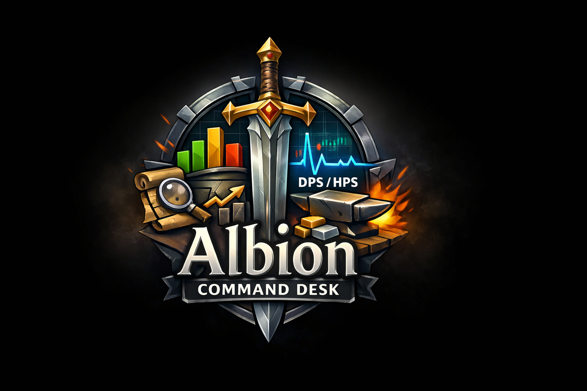
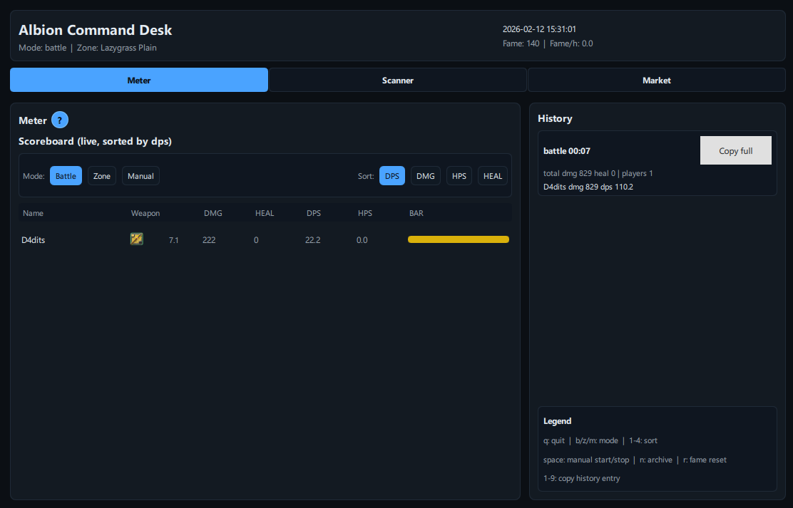
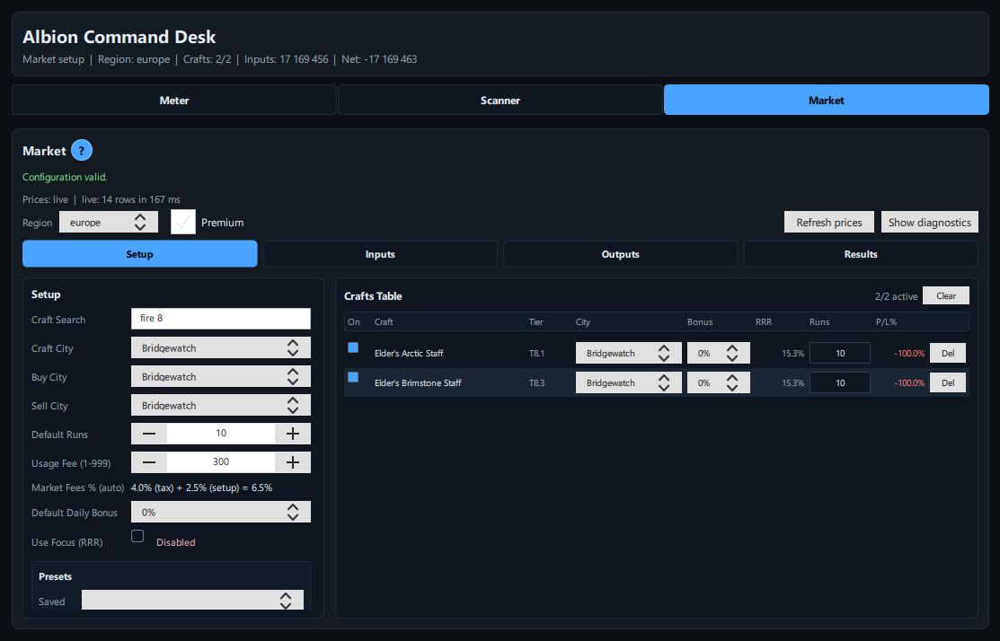

<p align="center">
  
</p>

# Albion Command Desk

External Albion Online companion app (Qt desktop UI):
- DPS/HPS meter (live or PCAP replay)
- party-focused combat stats
- scanner helper tab
- market crafting workspace (setup, inputs, outputs, results)
- market presets plus shopping/selling/results CSV export

No client hooks, no overlays, no memory editing.

<p align="center">
  
  
  
</p>

## Support the Project

<p align="center">
  <a href="https://www.paypal.com/donate/?business=albiosuperacc%40linuxmail.org&currency_code=USD&amount=20.00"></a>
  <a href="https://buycoffee.to/ao-dps/"></a>
</p>

## Install

### Windows (recommended, no Git required)
1. Open latest release: `https://github.com/D4dits/Albion-Command-Desk/releases/latest`
2. Download `AlbionCommandDesk-Setup-vX.Y.Z-x86_64.exe`
3. Run installer

Installer creates:
- runtime: `%LOCALAPPDATA%\AlbionCommandDesk\runtime\vX.Y.Z`
- venv: `%LOCALAPPDATA%\AlbionCommandDesk\venv`
- shortcuts: Desktop + Start Menu

### Source install (Windows/Linux/macOS)

Windows:
```powershell
git clone https://github.com/D4dits/Albion-Command-Desk.git
cd Albion-Command-Desk
powershell -ExecutionPolicy Bypass -File .\tools\install\windows\install.ps1
```

Linux:
```bash
git clone https://github.com/D4dits/Albion-Command-Desk.git
cd Albion-Command-Desk
bash ./tools/install/linux/install.sh
```

macOS:
```bash
git clone https://github.com/D4dits/Albion-Command-Desk.git
cd Albion-Command-Desk
bash ./tools/install/macos/install.sh
```

## Run

Windows:
```powershell
.\venv\Scripts\albion-command-desk core
# live capture:
# .\venv\Scripts\albion-command-desk live
```

Linux/macOS:
```bash
./venv/bin/albion-command-desk core
# live capture:
# ./venv/bin/albion-command-desk live
```

Release-EXE install path (Windows):
```powershell
& "$env:LOCALAPPDATA\AlbionCommandDesk\venv\Scripts\albion-command-desk.exe" core
```

Replay mode:
```powershell
albion-command-desk replay .\path\to\capture.pcap
```

## Requirements

- Python 3.10+ (3.11/3.12 recommended)
- For `live` mode:
  - Windows: Npcap Runtime (`https://npcap.com/#download`)
  - Linux/macOS: libpcap/system capture libs
- Git is required only for scanner repo sync/update actions

Npcap SDK is **not** required for normal end users.

## Optional: game data extraction

For better item/map coverage:

Windows:
```powershell
.\tools\extract_items\run_extract_items.ps1 -GameRoot "C:\Program Files\Albion Online"
```

Linux/macOS:
```bash
./tools/extract_items/run_extract_items.sh --game-root "/path/to/Albion Online"
```

## Screenshots
<p align="center">
  
</p>
<p align="center">
  
</p>

## Docs

- `docs/TROUBLESHOOTING.md`
- `docs/ARCHITECTURE.md`
- `docs/DELIVERY_BACKLOG.md`
- `docs/release/RELEASE_CHECKLIST.md`
- `docs/release/RELEASE_RUNBOOK.md`
- `CHANGELOG.md`

## Tests

```powershell
python -m pytest -q
```
